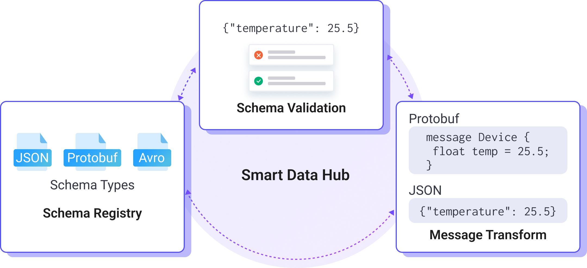

# Smart Data Hub

The Smart Data Hub of EMQX is an all-in-one solution for intelligent data processing. It is designed to simplify and efficiently manage MQTT data streams. With the Smart Data Hub, you can easily manage schemas, validate data, and perform real-time data transformations as needed. Whether for data validation or message transformation, this platform enables automated and efficient data management.

## Key Features

The Smart Data Hub provides the following key features:

- **[Schema Registry](./schema-registry.md)**: Create, modify, and delete data schemas to ensure consistency in data formats and standards.
- **[Schema Validation](./schema-validation.md)**: Validate incoming data against predefined schemas to prevent formatting errors and data inconsistencies.
- **[Message Transformation](./message-transformation.md)**: Transform data messages in real-time, formatting or mapping MQTT data as needed to suit various application scenarios.

