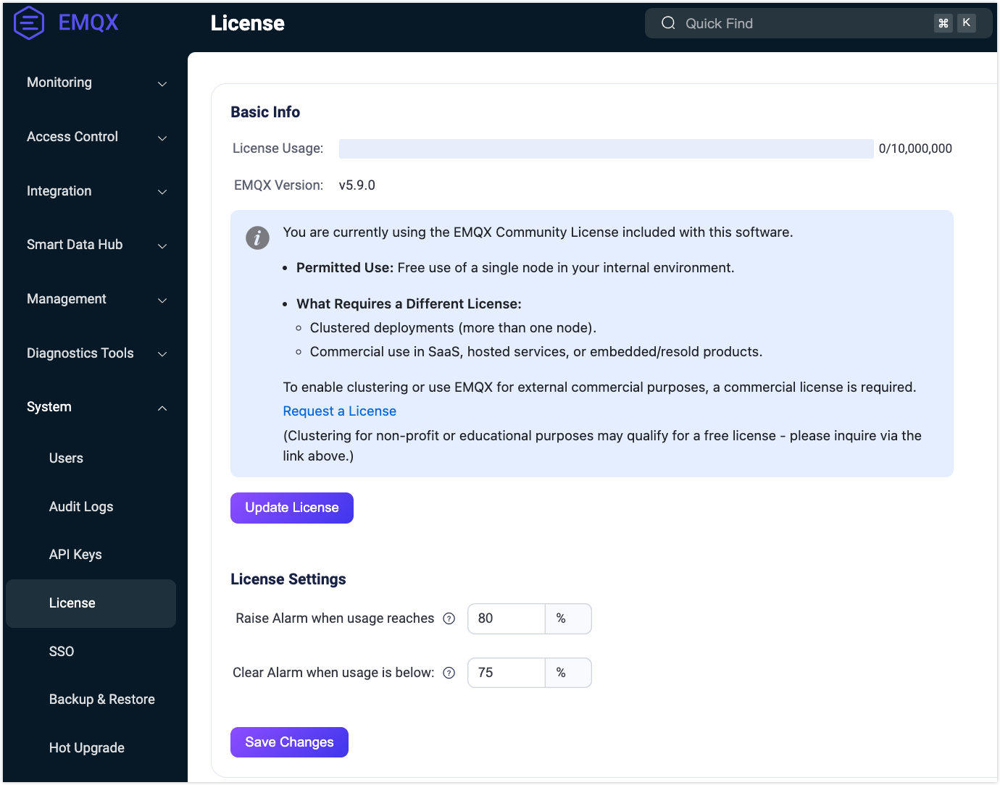

# Work with EMQX Enterprise License

Starting from EMQX 5.9, EMQX is released under the Business Source License (BSL) 1.1, a source-available license that allows open development while protecting EMQX’s commercial use.

As part of the installation package, EMQX Enterprise already includes a single-node Community License with limited commercial use permission. However,  if you use EMQX Enterprise for full commercial usage and cluster deployment, you must obtain a Commercial License. 

This page guides you through the process of obtaining a Commercial License and importing it into EMQX.

## Apply for a License

To apply for a Commercial License with a valid License Key, contact your EMQ sales representative or fill out the contact information on our [Contact Us](https://www.emqx.com/en/contact?product=emqx&channel=apply-Licenses) page to apply for a commercial license. Our sales representative will contact you as soon as possible. 

Suppose you prefer to try EMQX Enterprise before purchasing. In that case, you can apply for a Trial License on our [Trial License application page,](https://www.emqx.com/en/apply-licenses/emqx) and the license file will be sent to your email box immediately:

- The Trial License is valid for 15 days.
- The Trial License supports 10,000 concurrent sessions.

::: tip Note

All the EMQX Enterprise features are available during the trial period. However, the Clustering feature will be disabled after the trial period expires. You will need to purchase a Commercial License to continue using the Clustering feature.

EMQX Enterprise under a Trial License is not permitted for use in production environments.

:::

If you want to extend the trial period, contact our sales department.

## Update and Configure License Settings

You can update your license file and configure the settings for the license connection quota usage through the EMQX Dashboard, command line interface (CLI), or the configuration file.

### Dashboard

1. On the EMQX Dashboard, click **System** -> **License** from the left navigation menu. In the **Basic Info** section on the License page, you can check information such as License connection quota usage, EMQX version, and issue information. 

2. Click the **Update License** button. Paste your License Key in the pop-up dialog box, and click **Save**. The license information on the page automatically refreshes following your submission.

   Verify the information to confirm that the new license file has taken effect.

3. In the **License Settings** section, you can configure the watermark limits for the license connection quota usage.

   - **Usage High Watermark**: Specify the percentage value to set the threshold above which alarms for license connection quota usage will be triggered.
   - **Usage Low Watermark**: Specify the percentage value to set the threshold below which alarms for license connection quota usage will be deactivated.

4. Click **Save Changes** to save your License settings.

   

#### Revert to Community License

The EMQX Dashboard allows users to revert to the default single-node Community License. You can click the **Remove License** button on the **License** page and confirm in the pop-up dialog to remove the current License.

::: tip Note

In cluster mode, the License cannot be removed. If you are using EMQX in cluster mode, you must first dissolve the cluster.

:::

After reverting to the Community License:

- The current License will be cleared and replaced with the Community License.
- Existing client connections will remain active.

::: tip Note

The Community License does not allow full commercial use and supports only single-node deployments. Removing the License will disable clustered deployment.

:::

### CLI

You can also use the following command to update your EMQX Enterprise License:

```bash
./bin/emqx ctl 

    license info             # Show license info 
    license update <License> # Update license given as a string
    license update default   # Revert to default Community License
```

### Configuration File

You can also configure the license file with the configuration file. After the configuration, you can run `emqx ctl license reload` in [EMQX command line tool](../admin/cli.md) to reload the license. 

```bash
license {
    ## License Key
    key = "MjIwMTExCjAKMTAKRXZhbHVhdGlvbgpjb250YWN0QGVtcXguaW8KZGVmYXVsdAoyMDIzMDEwOQoxODI1CjEwMAo=.MEUCIG62t8W15g05f1cKx3tA3YgJoR0dmyHOPCdbUxBGxgKKAiEAhHKh8dUwhU+OxNEaOn8mgRDtiT3R8RZooqy6dEsOmDI="
    ## Low watermark limit below which license connection quota usage alarms are deactivated
    connection_low_watermark = "75%"

    ## High watermark limit above which license connection quota usage alarms are activated
    connection_high_watermark = "80%"
}
```

After execution, you can run `emqx ctl license info` to confirm that the new license file has taken effect.

<!-- 您也可以通过环境变量 `EMQX_LICENSE__KEY` 变量名设置您的 License。TODO 确认是否可以 reload -->
