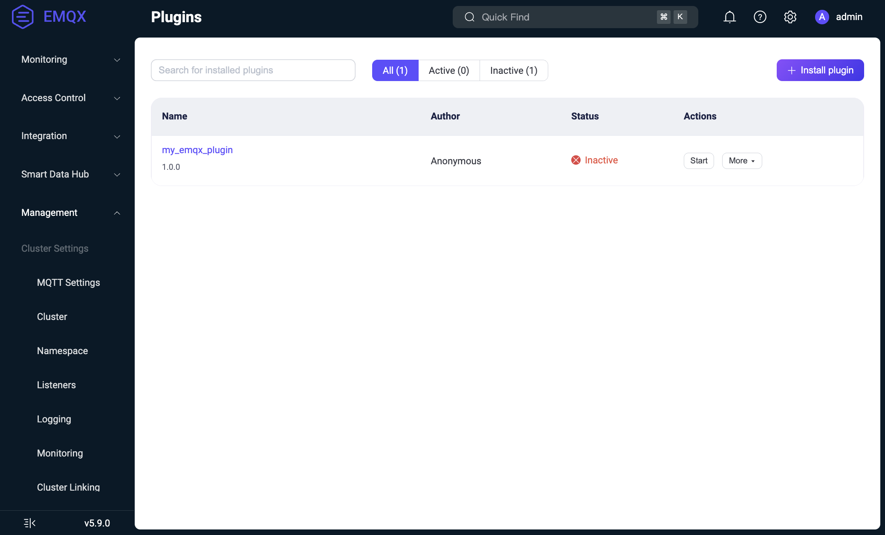

# Manage Plugins

This page covers the plugin lifecycle in EMQX and explains how to install, configure, start, stop, uninstall, and upgrade plugins using the Dashboard, CLI, or REST API.

## Plugin Lifecycle

An EMQX plugin goes through three main lifecycle states:

- **Installed**: The plugin's code and configuration are loaded, but the application is not yet started.
- **Started**: The plugin is running and actively interacting with EMQX.
- **Uninstalled**: The plugin is completely removed from the system.

### Installation Process

The installation process is as follows:

1. The plugin package (the tarball created by the `make rel` command) is uploaded via the Dashboard, API or CLI. For detailed installation steps, see [Install and Manage Plugins](#install-and-manage-plugins).
2. The plugin package is transferred to each node of the EMQX cluster.
3. On each node:
   - The tarball is saved in the `plugins` subdirectory in the EMQX root directory (this may be overridden by the `plugins.install_dir` option): `$EMQX_ROOT/plugins/my_emqx_plugin-1.0.0.tar.gz`.
   - It is unpacked into the same directory: `$EMQX_ROOT/plugins/my_emqx_plugin-1.0.0/`.
   - The initial configuration (`config.hocon` from the main plugin's app) is copied into the `$EMQX_DATA_DIR/plugins/my_emqx_plugin/config.hocon` file.
   - The Avro schema is loaded (if present) for validation.
   - The plugin code is loaded into the node, but the application is not started.
   - The plugin is registered as `disabled` in the EMQX config (`plugins.states`).

::: tip

For plugins, only the plugin state (`true` or `false` for the `enable` flag) is stored in the EMQX config. Full plugin configurations reside in the `$EMQX_DATA_DIR/plugins/my_emqx_plugin/config.hocon` file on the nodes.

:::

### Configuration

After installation, plugin configuration can be updated through the Dashboard or API:

- The new configuration is validated against the Avro schema (if present).
- Updates are distributed to all cluster nodes.
- The plugin's `on_config_changed/2` callback function is called. If the plugin accepts the new configuration, it is persisted in the `$EMQX_DATA_DIR/plugins/my_emqx_plugin/config.hocon` file.

::: tip

`on_config_changed/2` callback function is called even if the application is not started.

:::

::: tip

`on_config_changed/2` callback function is called on each node of the EMQX cluster. Avoid implementing configuration validation that depends on local system state (e.g., checking network availability), as this can lead to inconsistent results across nodes. Use `on_health_check/1` for runtime checks instead and report an unhealthy status if some resource is not available.

:::

### Starting

The plugin is started manually via the Dashboard, API, or CLI. Upon starting:

- The plugin's application is started.
- The plugin is registered as `enabled` in the EMQX config (`plugins.states`).

When the plugin is started and its information is requested, the `on_health_check/1` callback function is called to retrieve the plugin's status.

### Stopping

When the plugin is stopped:

- The plugin's applications are stopped.
- The plugin is registered as `disabled` in the EMQX config (`plugins.states`).

Although the plugin’s application is stopped, its code remains loaded on the node, as a stopped plugin can still be configured.

### Uninstallation Process

The uninstallation process is as follows:

1. The plugin is stopped (if it is running).
2. The plugin's code is unloaded from the node.
3. Its package files are removed from the nodes (the config file is preserved). 
4. The plugin is unregistered in the EMQX config (`plugins.states`).

You can uninstall a plugin package via the Dashboard or CLI. For details, see [Install and Manage Plugins](#install-and-manage-plugins).

### Cluster Join Behavior

When an EMQX node joins the cluster, it may not have the actual plugins installed and configured since the plugins and their configs reside in the local file systems of the nodes.

The new node does the following:

- When a node joins the cluster, it obtains the global EMQX config (as a part of the cluster join process).
- From the EMQX config, it knows plugin statuses (which plugins are installed and which are enabled).
- The new node requests the plugins and their actual configs from other nodes.
- The new node installs plugins and starts the enabled ones.

## Install and Manage Plugins

EMQX supports plugin package installation, uninstallation, and management via the Dashboard, CLI, and API.

### Install Packages via Dashboard

Suppose your plugin is already built and the tarball `my_emqx_plugin-1.0.0.tar.gz` is available. To install a compiled plugin package directly via the Dashboard, follow the steps below:

::: tip Important Security Update

For security reasons, EMQX now requires explicit authorization before plugin installation via the Dashboard.

- Installation permission must be granted before initiating the process.

- The allowed state is temporary and is automatically revoked after installation completes.

- If running in a clustered environment, permission must be granted on all nodes before installation.

  :::

1. Run the following command in the CLI to explicitly allow the plugin installation:

   ```bash
   emqx ctl plugins allow $NAME-$VSN
   ```

   - `{NAME}`: The name of your plugin (e.g., `my_emqx_plugin`).
   - `{VSN}`: The version of the plugin (e.g., `1.0.0`).

   Once this command is executed, you can proceed with the installation through the Dashboard.

2. Navigate to **Management** -> **Plugins** in the EMQX Dashboard. 

3. Click the **+ Install plugin** button to open the Install plugin page.

4. Select or drag the plugin package to upload it to the Dashboard.

   

5. Click the **Install** button to complete the installation. You will see the list of plugins with the new plugin installed.

   

Now you can start/stop the plugin and configure it.To uninstall a plugin package via Dashboard, click the **Uninstall** button under the **More** menu in the **Actions** column on the plugin list page.

To revoke permission for a previously allowed plugin, either:

1. Uninstall the plugin (if already installed).
2. Or explicitly disallow it using the following command:

```bash
emqx ctl plugins disallow $NAME-$VSN
```

### Install Packages via CLI

Suppose your plugin is already built and the tarball `my_emqx_plugin-1.0.0.tar.gz` is available. To install a compiled plugin package directly via the CLI, follow the steps below:

1. On an EMQX node, copy the tarball to the EMQX plugins directory:

   ```
   $ cp my_emqx_plugin-1.0.0.tar.gz $EMQX_HOME/plugins
   ```

2.  Install the plugin:

   ```
   $ emqx ctl plugins install my_emqx_plugin-1.0.0
   ```

3. Check plugin list:

   ```
   $ emqx ctl plugins list
   ```

4. Start/stop the plugin:

   ```
   $ emqx ctl plugins start my_emqx_plugin-1.0.0
   $ emqx ctl plugins stop my_emqx_plugin-1.0.0
   ```

5. Uninstall the plugin:

   ```
   $ emqx ctl plugins uninstall my_emqx_plugin-1.0.0
   ```

### Install Packages via API

Suppose your plugin is already built and the tarball `my_emqx_plugin-1.0.0.tar.gz` is available. To install a plugin using the API, follow these steps:

1. Allow the installation. To enable the installation of the plugin, run the following command:

   ```
   emqx ctl plugins allow my_emqx_plugin-1.0.0
   ```

2. Install the plugin. Use `curl` to install the plugin by sending a POST request to the API:

   ```
   $ curl -u $KEY:$SECRET -X POST http://$EMQX_HOST:18083/api/v5/plugins/install -H "Content-Type: multipart/form-data" -F "plugin=@my_emqx_plugin-1.0.0.tar.gz"
   ```

3. Check plugin list. To verify if the plugin has been installed successfully, run:

   ```
   $ curl -u $KEY:$SECRET http://$EMQX_HOST:18083/api/v5/plugins | jq
   ```

4. Start/stop the plugin. To start or stop the plugin, use the following commands:

   ```
   $ curl -s -u $KEY:$SECRET -X PUT "http://$EMQX_HOST:18083/api/v5/plugins/my_emqx_plugin-1.0.0/start"
   $ curl -s -u $KEY:$SECRET -X PUT "http://$EMQX_HOST:18083/api/v5/plugins/my_emqx_plugin-1.0.0/stop"
   ```

## Upgrade Plugins

EMQX does not allow multiple versions of the same plugin to be installed simultaneously.

To install a new version of the plugin:

- The old version must first be uninstalled.
- The new version is then installed.

The plugin configuration is preserved across installations.

<!-- **Note**: (EMQX enterprise) Plugins need to be reinstalled after hot upgrades. -->