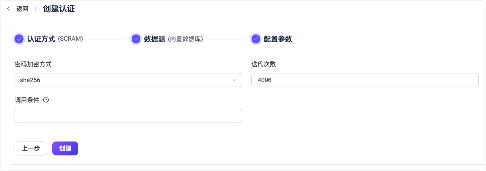

# MQTT 5.0 增强认证 - SCRAM

EMQX 提供了基于 [Salted Challenge Response Authentication Mechanism（SCRAM）](https://doubleoctopus.com/security-wiki/protocol/salted-challenge-response-authentication-mechanism/)的增强认证功能，此认证器使用 EMQX 内置数据库来存储客户端凭证（*用户*）。

SCRAM 认证是一种比密码认证更复杂的机制，它依赖与 MQTT 5.0 提供的增强认证机制，需要在连接期间交换额外的 MQTT 报文。同时由于 SCRAM 认证不依赖外部数据源，因此使用更加简单轻量。

::: tip
SCRAM 认证仅支持使用 MQTT v5.0 的连接。
:::

## 通过 Dashboard 配置

1. 在 [EMQX Dashboard](http://127.0.0.1:18083/#/authentication) 页面，点击左侧导航栏的**访问控制** -> **认证**。

2. 在**认证**页面，点击**创建**。

3. 依次选择**认证方式**为 **SCRAM**，**数据源**为 **Built-in Database**，点击**下一步**进入**配置参数**步骤：

   

4. 按照以下说明配置数据源：
   - **密码加密方式**: 按照实际需求选择`sha256` 或 `sha512`。
   - **迭代次数**：此参数定义了在 SCRAM 身份验证过程中用于哈希密码的迭代次数。较高的迭代次数通过增加哈希过程的计算开销来提高安全性，从而减缓暴力破解攻击的速度。默认值为 `4096`。调整此值会影响性能和安全性，因此应根据系统需求进行配置。
   - **调用条件**：一个 Variform 表达式，用于控制是否将此 Built-in Database 认证器应用于客户端连接。该表达式会根据客户端的属性（例如 `username`、`clientid`、`listener` 等）进行评估。如果表达式的结果为字符串 `"true"`，则会触发认证器。否则，认证器将被跳过。有关调用条件的更多信息，请参见[认证器调用条件](./authn.md#认证器调用条件)。
5. 点击**创建**完成设置。

## 通过配置文件配置

配置示例如下：

```hcl
{
    mechanism = scram
    backend = built_in_database

    algorithm = sha512
    iteration_count = 4096
}
```

其中：

- `algorithm`：对应 Dashboard 的密码加密方式；可选值：**sha256** 或 **sha512**
- `iteration_count`（可选）：输入一个整数以指定迭代次数，默认值： **4096**
