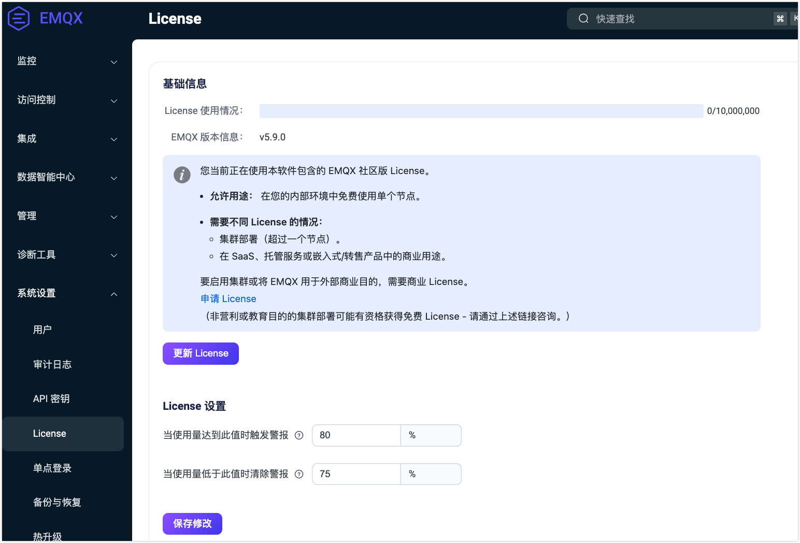

# EMQX 企业版 License

从 EMQX 5.9 开始，EMQX 采用了商业源代码许可证（BSL）1.1，这是一种源代码可用的许可证，允许开放开发，同时保护 EMQX 的商业使用。

作为安装包的一部分，EMQX 企业版已包含一个单节点社区版 License，具有有限的商业使用权限。但是，如果您要将 EMQX 企业版用于全面的商业用途和集群部署，您必须获得商业 License。

本页将指导您如何购买商业 License 并导入到 EMQX 中。

## 获取 License

如果您要直接购买一个有效的商业 License 密钥，请联系您之前的 EMQ 销售代表，或点击[此处](https://www.emqx.com/zh/contact?product=emqx&channel=apply-Licenses)通过官网提交您的联系方式，我们的销售代表将尽快与您联系。

如果您想在购买前试用 EMQX 企业版，您可以在[此处](https://www.emqx.com/zh/apply-licenses/emqx)自助申请试用 License，License 文件将会立即发送至您的邮箱：

- License 有效期为 15 天；
- License 支持的并发连接为 10000 线。

::: tip 注意

在试用期间，所有 EMQX 企业版功能均可使用。然而，试用期结束后，集群功能将会被禁用。您需要购买商业 License 才能继续使用集群功能。

试用 License 下的 EMQX 企业版不允许用于生产环境。

:::

更多连接以及试用时长的 License 可以向销售人员申请。

## 更新和设置 License 

您可以通过 Dashboard、命令行或配置文件更新 License 并且设置 License 连接配额使用水位线。

### Dashboard 

1. 打开 EMQX Dashboard，从左侧导航目录点击**系统设置**-> **License**, 在 **License** 页面的**基础信息**区域，您可以看到 EMQX 当前 License 的基础信息，包括 License 连接配额使用情况、EMQX 版本信息和 License 签发信息等。

2. 点击**更新 License** 按钮，在弹出框中粘贴您的 License Key，点击提交即可。提交完成后页面数据将刷新，请确认新的 License 文件是否生效。

3. 在 **License 设置**区域，您可以配置 License 连接配额使用的水位限制。
   - **使用量高水位线**：指定超过该百分比值将触发 License 连接配额使用告警的限制。
   - **使用低水位线**：指定低于该百分比值将取消 License 连接配额使用告警的限制。

4. 点击**保存修改**保存您的设置。

   

#### 恢复社区版 License

EMQX Dashboard 允许用户将系统恢复为默认的单节点社区版 License。您可以在 **License** 页面上点击**移除 License** 按钮，在弹出的对话框中进行二次确认以移除当前的 License。

::: tip 提示

集群模式下无法移除 License。如果您正在使用集群部署，需要先解散集群。

:::

恢复为默认的社区版 License 后：

- 当前的 License 将被清除，并替换为默认的社区版 License。
- 当前已连接的客户端不会受到影响。

::: tip 提示

社区版 License 不支持完整的商业用途，仅适用于单节点部署。移除 License 将会禁用集群部署。

:::

### 命令行

您还可以使用以下命令来更新您的 EMQX 企业版 License：

```bash
./bin/emqx ctl 

    license info             # 显示 license 信息 
    license update <License> # 更新 license，<License> 为 license 字符串
    license update default   # 恢复为默认社区版 License
```

### 配置文件

您可以通过配置文件设置 License，设置完成后请在 [EMQX 命令行](../admin/cli.md)中执行 `emqx ctl license reload` 重新加载 License：

```bash
license {
    ## License Key
    key = "MjIwMTExCjAKMTAKRXZhbHVhdGlvbgpjb250YWN0QGVtcXguaW8KZGVmYXVsdAoyMDIzMDEwOQoxODI1CjEwMAo=.MEUCIG62t8W15g05f1cKx3tA3YgJoR0dmyHOPCdbUxBGxgKKAiEAhHKh8dUwhU+OxNEaOn8mgRDtiT3R8RZooqy6dEsOmDI="
    ## Low watermark limit below which license connection quota usage alarms are deactivated
    connection_low_watermark = "75%"

    ## High watermark limit above which license connection quota usage alarms are activated
    connection_high_watermark = "80%"
}
```

加载完成后执行 `emqx ctl license info` 命令查看 License 是否符合您的预期。

<!-- 您也可以通过环境变量 `EMQX_LICENSE__KEY` 变量名设置您的 License。TODO 确认是否可以 reload -->