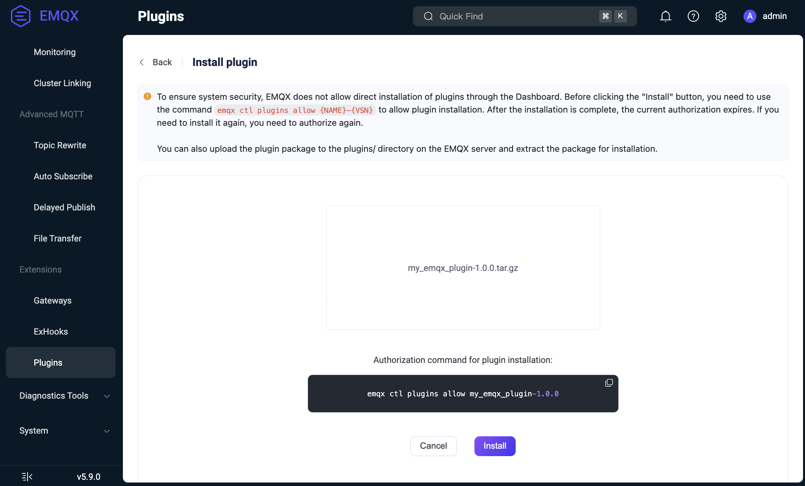

# 管理插件

本页面介绍了 EMQX 中插件的生命周期，并解释了如何使用 Dashboard、CLI 或 REST API 安装、配置、启动、停止、卸载和升级插件。

## 插件生命周期

EMQX 插件有三个主要生命周期状态：

- **已安装（Installed）**：插件的代码和配置已加载，但应用尚未启动。
- **已启动（Started）**：插件正在运行，并与 EMQX 活跃交互。
- **已卸载（Uninstalled）**：插件已从系统中完全移除。

### 安装流程

插件的安装流程如下：

1. 通过 Dashboard、API 或 CLI 上传插件包（由 `make rel` 命令生成的 `.tar.gz` 压缩包）。详细安装步骤参见[安装和管理插件](#安装和管理插件)。
2. 插件包会被分发至 EMQX 集群的每个节点。
3. 在每个节点上：
   - 压缩包保存在 EMQX 根目录下的 `plugins` 子目录（可通过 `plugins.install_dir` 配置覆盖），例如：`$EMQX_ROOT/plugins/my_emqx_plugin-1.0.0.tar.gz`。
   - 插件包会被解压到同一目录：`$EMQX_ROOT/plugins/my_emqx_plugin-1.0.0/`。
   - 插件初始配置文件（来自插件主应用的 `config.hocon`）被复制到 `$EMQX_DATA_DIR/plugins/my_emqx_plugin/config.hocon`。
   - 若存在 Avro schema，则会被加载以用于配置校验。
   - 插件代码被加载到节点，但应用未启动。
   - 插件在 EMQX 配置中被注册为 `disabled`（禁用）状态，保存在 `plugins.states` 字段中。

::: tip

对于插件，只有启用状态（即 `enable` 标志为 `true` 或 `false`）保存在 EMQX 配置中。插件的完整配置保存在每个节点上的 `$EMQX_DATA_DIR/plugins/my_emqx_plugin/config.hocon` 文件中。

:::

### 配置

插件安装后，可以通过 Dashboard 或 API 更新配置：

- 新配置将通过 Avro schema（如果存在）进行校验。
- 配置更新会分发到集群的所有节点。
- 插件的 `on_config_changed/2` 回调函数将被调用。如果插件接受该配置，则配置将被持久化写入 `$EMQX_DATA_DIR/plugins/my_emqx_plugin/config.hocon`。

::: tip

即使插件应用尚未启动，`on_config_changed/2` 回调函数仍会被调用。

:::

::: tip

`on_config_changed/2` 回调函数会在集群每个节点上调用。避免编写依赖本地系统状态（例如检查网络可用性）的配置校验逻辑，这可能导致节点间结果不一致。应将此类检查逻辑放在 `on_health_check/1` 回调函数中，并在资源不可用时上报不健康状态。

:::

### 启动

可通过 Dashboard、API 或 CLI 手动启动插件。启动时：

- 插件的应用被启动。
- 插件状态在 EMQX 配置中被标记为 `enabled`（启用）。

当插件启动后被查询状态时，会调用其 `on_health_check/1` 回调函数以返回运行状态。

### 停止

插件被停止时：

- 插件的应用会被停止。
- 插件状态在 EMQX 配置中被标记为 `disabled`（禁用）。

注意，虽然插件应用已停止，但其代码仍保留在节点中，因此即使停止状态下仍可以配置插件。

### 卸载流程

卸载流程如下：

1. 如果插件正在运行，则先停止插件。
2. 卸载插件代码。
3. 删除插件包文件（配置文件会保留）。
4. 插件从 EMQX 配置（`plugins.states`）中注销。

你可以通过 Dashboard 或 CLI 卸载插件，详见[安装和管理插件](#安装和管理插件)。

### 集群节点加入行为

当新节点加入集群时，可能尚未安装或配置所需插件，因为插件及其配置是保存在每个节点的本地文件系统中的。

新节点将执行以下操作：

- 加入集群时，会同步整个 EMQX 的全局配置。
- 从全局配置中得知哪些插件已安装及其启用状态。
- 请求其他节点发送插件包和配置。
- 安装插件，并启动已启用的插件。

## 安装和管理插件

EMQX 支持通过 Dashboard、CLI 和 API 安装、卸载和管理插件包。

### 通过 Dashboard 安装插件

假设你已经构建好插件，并且已有 `my_emqx_plugin-1.0.0.tar.gz` 文件。可按照以下步骤在 Dashboard 中安装：

::: tip 安全性更新

出于安全考虑，现在通过 Dashboard 安装插件需要显式授权：

- 必须先授予安装权限，才能开始上传安装流程。
- 授权状态是临时的，安装完成后会自动失效。
- 如果是集群环境，所有节点都需提前授权。

:::

1. 使用 CLI 显式授权：

   ```bash
   emqx ctl plugins allow $NAME-$VSN
   ```

   - `{NAME}`：插件名称（如 `my_emqx_plugin`）。
   - `{VSN}`：插件版本（如 `1.0.0`）。

2. 打开 EMQX Dashboard，进入**管理 > 插件**页面。

3. 点击 **+ 安装插件**按钮，打开上传页面。

4. 拖放或选择插件包文件上传。

   

5. 点击**安装**，插件即会被安装并显示在插件列表中。

   

现在，您可以启动/停止插件并进行配置。若要卸载插件，可点击插件列表中**更多 > 卸载**。

要撤销先前授予的安装权限，可：

1. 卸载已安装插件，或

2. 使用以下命令显式撤销授权：

   ```bash
   emqx ctl plugins disallow $NAME-$VSN
   ```

### 通过 CLI 安装插件

假设你已经构建好插件，并且已有 `my_emqx_plugin-1.0.0.tar.gz` 文件。可在 CLI 上按以下步骤操作：

1. 将插件包复制到 EMQX 插件目录：

   ```bash
   cp my_emqx_plugin-1.0.0.tar.gz $EMQX_HOME/plugins
   ```

2. 安装插件：

   ```bash
   emqx ctl plugins install my_emqx_plugin-1.0.0
   ```

3. 查看插件列表：

   ```bash
   emqx ctl plugins list
   ```

4. 启动 / 停止插件：

   ```bash
   emqx ctl plugins start my_emqx_plugin-1.0.0
   emqx ctl plugins stop my_emqx_plugin-1.0.0
   ```

5. 卸载插件：

   ```bash
   emqx ctl plugins uninstall my_emqx_plugin-1.0.0
   ```

### 通过 API 安装插件

假设你已经构建好插件，并且已有 `my_emqx_plugin-1.0.0.tar.gz` 文件。插件包构建完成后，可以使用 REST API 安装：

1. 首先需要授权安装：

   ```bash
   emqx ctl plugins allow my_emqx_plugin-1.0.0
   ```

2. 使用 `curl` 上传并安装插件：

   ```bash
   curl -u $KEY:$SECRET -X POST http://$EMQX_HOST:18083/api/v5/plugins/install \
        -H "Content-Type: multipart/form-data" \
        -F "plugin=@my_emqx_plugin-1.0.0.tar.gz"
   ```

3. 查看插件列表确认安装成功：

   ```bash
   curl -u $KEY:$SECRET http://$EMQX_HOST:18083/api/v5/plugins | jq
   ```

4. 启动 / 停止插件：

   ```bash
   curl -s -u $KEY:$SECRET -X PUT \
     "http://$EMQX_HOST:18083/api/v5/plugins/my_emqx_plugin-1.0.0/start"
   
   curl -s -u $KEY:$SECRET -X PUT \
     "http://$EMQX_HOST:18083/api/v5/plugins/my_emqx_plugin-1.0.0/stop"
   ```

## 插件升级

EMQX 不支持同时安装同一插件的多个版本。

要安装插件新版本：

- 必须先卸载旧版本；
- 然后再安装新版本。

插件配置会在升级过程中保留。

<!-- 注意：EMQX 企业版在热升级后需要重新安装插件。 -->