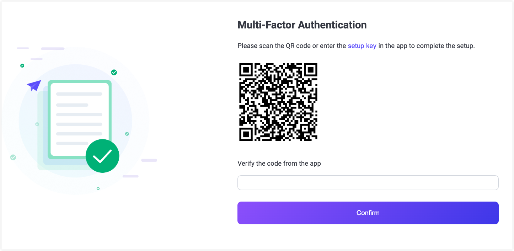

# 多因素认证

EMQX 5.9.0 引入了用于 EMQX Dashboard 的多因素认证（MFA）功能，以增强安全性。此功能要求用户在登录时完成两步认证过程。该过程通过使用密码和基于时间的一次性密码（TOTP）验证用户身份，为系统增加了额外的安全层，防止未经授权的访问。

本页同时从管理员和用户的角度出发解释了如何为 EMQX Dashboard 设置和使用 MFA。

## 关键概念

- **MFA**：一种安全功能，要求提供两种身份验证方式：用户的密码和第二种因素，如由身份验证器应用生成的TOTP。
- **TOTP**：由身份验证应用程序（如 Google Authenticator 或 Authy）生成的临时验证码，基于应用程序与服务器之间共享的密钥。
- **二维码**：共享密钥的图形表示，可以通过身份验证应用程序扫描以简化设置过程。

## MFA 如何工作

当 EMQX Dashboard 启用 MFA 时，它通过增加额外的安全层来增强登录过程。以下是 MFA 的工作原理：

1. **用户登录**：当您尝试登录 Dashboard 时，首先输入您的用户名和密码。
2. **MFA 提示**：如果您的账户启用了 MFA，系统将提示您输入验证码。此验证码由您手机上的身份验证应用程序生成。
3. **首次设置**：如果之前没有设置 MFA，系统将要求您扫描二维码或手动输入密钥，将其添加到您的身份验证应用程序中，完成设置。
4. **后续登录**：完成首次设置后，每次登录时，您需要打开身份验证应用程序并输入它生成的时效性验证码来完成登录过程。

MFA 的目标是确保即使有人获得了您的密码，也无法登录您的账户，因为他们还需要访问您身份验证应用程序中生成的验证码。

## 启用和配置 MFA

MFA 默认为禁用状态。要为用户启用 MFA，管理员必须配置系统以支持 MFA，并为各个用户设置它。只有具有[管理员权限](../dashboard/system.md#用户)的用户才能为其他用户启用或禁用 MFA。

### 通过 EMQX Dashboard 启用 MFA

管理员可以直接通过 Dashboard 启用 MFA，步骤如下：

1. 在 Dashboard 中，点击左侧菜单的**系统设置** -> **用户**。
2. 在**用户**页面中，您将看到一个用户列表。在**操作**列中，点击您要为其启用 MFA 的用户旁边的 **MFA 设置**。
3. 在 **MFA 设置**对话框中，点击**启用 MFA** 以为所选用户启用 MFA。

启用后，用户将在下次登录时需要完成 MFA 设置过程。

### 重置 TOTP 密钥

如果用户需要重置其 TOTP 设置（例如，如果身份验证应用程序被卸载或密钥被泄露），管理员可以通过 **MFA 设置**对话框重置该用户的 TOTP 密钥。

1. 在**系统设置** -> **用户**页面中，找到您要重置 TOTP 密钥的用户。在**操作**列中，点击该用户旁边的 **MFA 设置**。

2. 在 **MFA 设置**对话框中，您将看到**重置 TOTP 密钥**按钮。点击该按钮将启动重置过程。

   会出现一个确认提示，通知您重置密钥将使之前的密钥无效。用户将在下次登录时需要设置一个新的 TOTP 密钥。

3. 点击**确定**以继续重置。重置后，用户将在下次登录时需要遵循首次 MFA 设置过程（扫描新的二维码或将新密钥输入到身份验证应用程序中）。

### 通过配置文件和 REST API 启用和管理 MFA

管理员可以通过配置文件和 REST API 启用或管理用户的 MFA。

::: tip

在 `/users/{username}/mfa` 端点上使用 POST 和 DELETE 方法时，仅管理员或当前身份验证令牌（即“Bearer token”）的所有者可以使用此接口。也就是说，具有“查看者”角色的用户无法修改其他用户的 MFA 设置。只有与当前身份验证令牌关联的用户（“Bearer token”拥有者）才能修改自己的 MFA 设置。

有关基于角色的访问控制（RBAC）的更多信息，请参见[用户](../admin/api.md#角色与权限)。

:::

#### 启用整个 Dashboard 的 MFA

要为整个 Dashboard 启用 MFA，管理员需要在配置文件中配置 `dashboard.default_mfa` 设置。该设置可以设置为 `none`（禁用 MFA）或 `{mechanism: totp}`（启用基于 TOTP 的 MFA）。

示例配置：

```bash
dashboard.default_mfa = {mechanism: totp}
```

#### 启用特定用户的 MFA

要为特定用户启用 MFA，管理员可以向 `/users/{username}/mfa` API 端点发送 POST 请求，请求体如下：

```json
{
  "mechanism": "totp"
}
```

#### 停用特定用户的 MFA

要为特定用户停用 MFA，管理员可以向 `/users/{username}/mfa` API 端点发送 DELETE 请求。

## 使用 MFA 登录

当 MFA 为您的账户启用后，您需要按照以下步骤登录 EMQX Dashboard：

### 首次设置

在首次登录并启用 MFA 后，您需要设置身份验证应用程序。

1. **输入您的用户名和密码**： 在登录页面，按通常方式输入您的用户名和密码。

2. **扫描二维码或输入设置密钥**： 在初步验证密码后，Dashboard 将提示您扫描二维码或手动将设置密钥输入到您的身份验证应用程序中以完成设置。

3. **验证应用程序中的代码**： 应用程序将生成未来登录的时效性验证码。输入应用程序中的验证码并点击**确定**。

   该验证码仅在短时间内有效（通常为 30 秒），因此请确保快速输入。



### 后续登录

完成初次设置后，您可以使用身份验证应用程序登录。

1. **输入您的用户名和密码**： 在后续的登录尝试中，输入您的用户名和密码。
2. **输入 TOTP 代码**： 验证密码后，系统会提示您输入由身份验证应用程序生成的 TOTP 代码。
3. **成功登录**： 如果验证码有效，您将成功登录 Dashboard。
4. **验证码无效**： 如果验证码错误或过期，您将看到一条错误消息。在这种情况下，您可以尝试重新输入当前身份验证应用程序中的验证码。